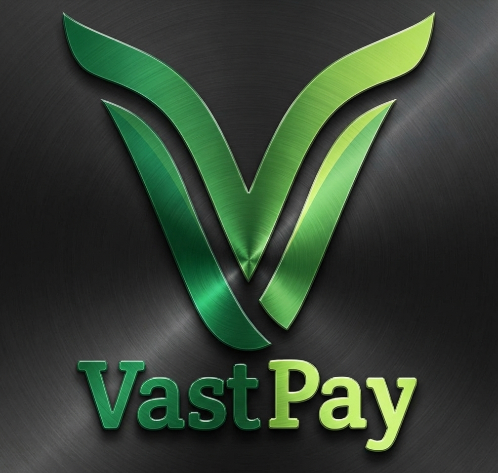

# Vast Pay Liberia

Welcome to the official code sanctuary of **Vast Pay Liberia**. We are building the future of digital finance using the MERN stack and React Native.  
Vast pays is a Fintech startup for seamless payment of goods and services.  
An Impact tools for health care and Liberia's first digital all in one platform, making payments inclusive.   
Bringing together Lonestar and Orange to improve mobile money usage in Liberia.  

  <kbd>
    
  </kbd>

## 🛠 Our Tech Stack
* **Mobile:** React Native (iOS & Android)
* **Frontend:** React.js / Tailwind CSS
* **Backend:** Node.js / Express.js
* **Database:** MongoDB Atlas
* **Infrastructure:** AWS / GitHub Actions

## 🔐 Security & Compliance
As a fintech organization, security is our #1 priority. 
* **Branch Protection:** All PRs require at least 1 approval before merging to `main`.
* **Secrets:** Never commit `.env` files. Use GitHub Secrets for CI/CD.
* **2FA:** Multi-factor authentication is mandatory for all organization members.

## 📂 Core Repositories
* [backend-api](link-to-repo) — The core MERN engine.
* [mobile-app](link-to-repo) — The React Native customer experience.
* [admin-dashboard](link-to-repo) — Internal tools and analytics.

## 🤝 Contribution Guidelines
1.  Always create a feature branch from `develop` (e.g., `feat/auth-module`).
2.  Ensure all tests pass locally before opening a Pull Request.
3.  Link your PRs to the relevant Jira/Trello task.

---
**Maintained by the Core Engineering Team.** For access requests or technical support, contact the Admin via Slack or [Email].
